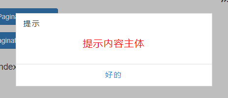
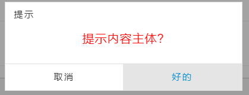
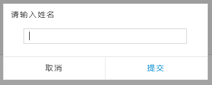

# PostbirdAlertBox.js
> 原生javascript弹框插件

## 在线体验：

<a href="http://postbird.oschina.io/postbirdpaginatordriver.js/" target="_blank">http://postbird.oschina.io/postbirdpaginatordriver.js/</a>

## 优点：
- 无需手动写入html
- 支持回调
- 可配置性高，多种显示选择
## 使用方式：

### 1. 引入文件：
```
postbirdAlertBox.js
postbirdAlertBox.js
```
### 2. 调用方式：

#### 1) alert

```javascript
        PostbirdAlertBox.alert({
            'title': '提示',
            'content': '提示内容主体',
            'okBtn': '好的',
            'contentColor': 'red',
            'onConfirm': function () {
                console.log("回调触发后隐藏提示框");
                alert("回调触发后隐藏提示框");
            }
        });
```
#### 2) confirm

```javascript
        PostbirdAlertBox.confirm({
            'title': '提示',
            'content': '离开本页面进行跳转',
            'okBtn': '好的',
            'contentColor': 'red',
            'onConfirm': function () {
                console.log("OK - 回调触发后隐藏提示框");
                alert("OK - 回调触发后隐藏提示框");
            },
            'onCancel': function () {
                console.log("Cancel-回调触发后隐藏提示框");
                alert("Cancel-回调触发后隐藏提示框");
            }
        });
```
#### 3) prompt

```javascript
        PostbirdAlertBox.prompt({
            'title': '请输入姓名',
            'okBtn': '提交',
            onConfirm: function (data) {
                console.log("输入框内容是：" + data);
                alert("输入框内容是：" + data);
            },
            onCancel: function (data) {
                console.log("输入框内容是：" + data);
                alert("输入框内容是：" + data);
            },
        });
```


## 配置选项：

<table  >
    <thead>
        <tr>
            <th>参数属性</th>
            <th>意义</th>
            <th>适用方法</th>
            <th>是否必须</th>
        </tr>
    </thead>
    <tbody>
        <tr>
            <td>title</td>
            <td>弹框标题</td>
            <td>alert、confirm（不适用于prompt）</td>
            <td>否，默认 : 提示信息</td>
        </tr>
        <tr>
            <td>promptTitle</td>
            <td>prompt标题</td>
            <td>prompt</td>
            <td>否，默认 :请输入内容</td>
        </tr>
        <tr>
            <td>content</td>
            <td>提示内容主体</td>
            <td>alert、confirm（不适用于prompt）</td>
            <td>否，默认 : 提示内容</td>
        </tr>
        <tr>
            <td>contentColor</td>
            <td>提示内容颜色</td>
            <td>alert、confirm</td>
            <td>否，默认 : #000000</td>
        </tr>
        <tr>
            <td>okBtn</td>
            <td>确认按钮文字</td>
            <td>alert、confirm （不适用于prompt）</td>
            <td>否，默认 : 好的</td>
        </tr>
        <tr>
            <td>promptOkBtn</td>
            <td>prompt确认按钮文字</td>
            <td>prompt</td>
            <td>否，默认 : 确认</td>
        </tr>
        <tr>
            <td>okBtnColor</td>
            <td>确认按钮颜色</td>
            <td>alert、confirm、prompt</td>
            <td>否，默认 : #0e90d2</td>
        </tr>
        <tr>
            <td>cancelBtn</td>
            <td>取消按钮文字</td>
            <td>alert、confirm、prompt</td>
            <td>否，默认 : 取消</td>
        </tr>
        <tr>
            <td>onConfirm</td>
            <td>确认按钮事件</td>
            <td>alert、confirm、prompt(存在参数data)</td>
            <td>否，默认 : 不触发事件</td>
        </tr>
        <tr>
            <td>onCancel</td>
            <td>取消按钮事件</td>
            <td>alert、confirm、prompt(存在参数data)</td>
            <td>否，默认 : 不触发事件</td>
        </tr>
    </tbody>
</table>

## 效果：

### Alert



### Confirn



### Prompt


